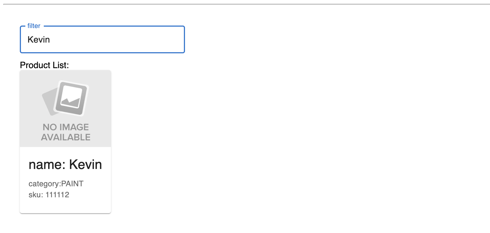
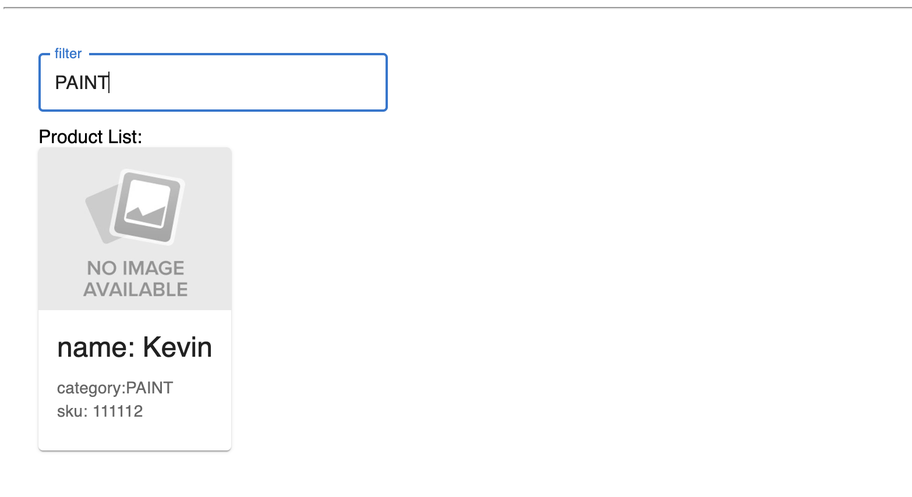

This project was bootstrapped with [Create React App](https://github.com/facebookincubator/create-react-app).

This is a practice project workspace for React, JS, TS.

## Instructions to Run:
- install node_modules
  ```
  npm install
  ```
- run application:
  ```
  npm run start
  ```
- 
## Games

#### Wordle
Wordle is a game where the user has 5 guesses to guess a 5-letter-word generated by random. 
- if the letter is correctly guesses in the right spot, it will appear green
- if the letter is in the incorrect spot, but appears elsewhere in the word, it will appear yellow.
- if the letter is not in the word at all, it will appear grey.
- users will be able to reset game at win or lose. 
- num guesses appear 

#### Examples

- Default game state

- Lose game state

- Win game state

#### Next Gamegt
____


### Rundoo
This is a simple web application for Rundoo takehome with a React frontend.
## Retrospective Overview:
- decided to bootsrap the frontend application to do so quickly
- decided not to use TypeScript even though we should for static typing enforcement
- attempted to use prop-types as alternative but for sake of time, did not have time
- added real-time debugger during development process to visually test form easily + validator
- should add debouncing on filter form to reduce API calls to server
- chose MUI for simple component library so I did not have to build everything
- added webpack, babel for bundle, performance
- added url-loader and file-loader for ability to add pictures in assets (public... here)
- simple css
- the components could be tighter, more modularized, but for ease just built as is
- did some fun color stuff with css with create button... red if bad form input, rundoo purple if good
- incorporated rundoo colors but didn't add to color stylesheet 
## Examples
- Default Load of Frontend App

- After form is validated (from FE), input turns Rundoo purple

- Create action triggered, Product List shows all results (deduped) as there is no filter enabled yet

- Create Fails when SKU is not 6 digits long (requirement added)

- Filter by Name

- Filter by Category

- Filter by SKU

